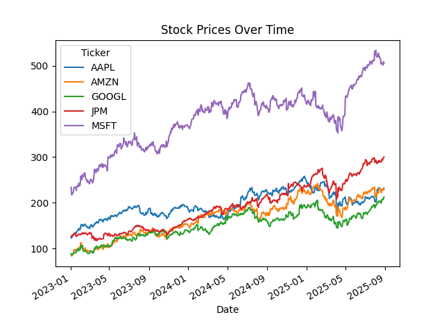
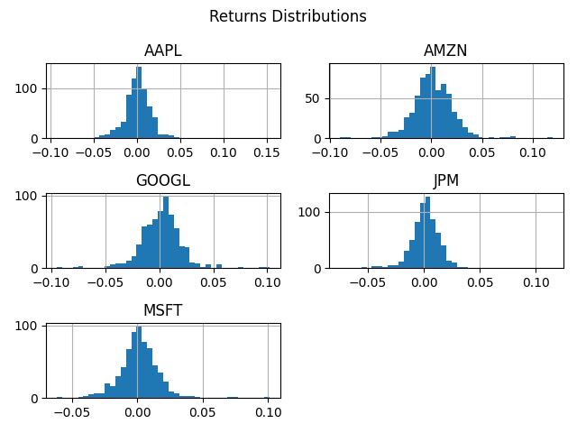
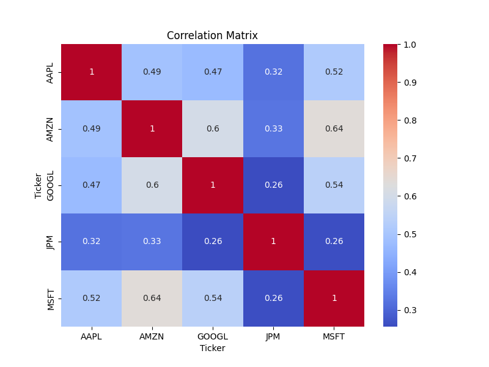
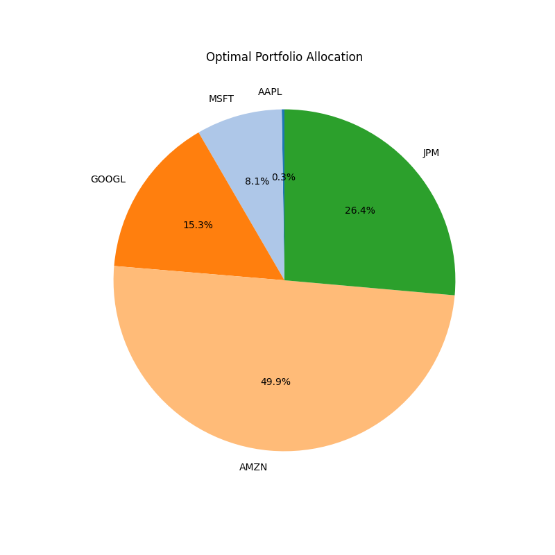

# Stock Portfolio Optimization (Python)

## 📌 Overview
This project implements a Python-based stock analysis and portfolio optimization tool using historical equity data.  
It evaluates risk-adjusted returns, diversification benefits, and optimal asset allocation using modern portfolio theory.

The project fetches historical stock prices, calculates financial metrics such as returns, volatility, and correlations, and constructs an optimal portfolio by maximizing the Sharpe ratio.

---

## 🧠 Key Features
- Historical stock data retrieval using Yahoo Finance
- Return, volatility, and correlation analysis
- Portfolio optimization using Sharpe ratio maximization
- Clear, interpretable financial visualizations
- Modular, reusable Python code

---

## 📊 Visualizations

### Stock Prices Over Time
Shows historical adjusted closing prices for selected equities.



---

### Return Distributions
Histograms illustrating the distribution of daily returns for each asset.



---

### Correlation Matrix
Heatmap displaying correlations between stock returns to highlight diversification effects.



---

### Optimal Portfolio Allocation
Visualization of optimal asset weights derived from Sharpe ratio optimization.



---

## ⚙️ Project Structure
```bash
stock-portfolio-optimization/
│
├── data/ # Raw or processed data (optional)
├── notebooks/
│ └── portfolio_analysis.ipynb
├── src/
│ ├── data_loader.py
│ ├── analytics.py
│ └── optimization.py
├── visuals/
│ └── charts/ # Saved visualizations
├── summary/
│ └── executive_summary.pdf
├── requirements.txt
└── README.md
```
---

## 🚀 How to Run the Project

1. Clone the repository:
```bash
git clone https://github.com/YOUR_USERNAME/stock-portfolio-optimization.git
cd stock-portfolio-optimization
```

2. Run the analysis 
```bash
jupyter notebook notebooks/portfolio_analysis.ipynb
```

